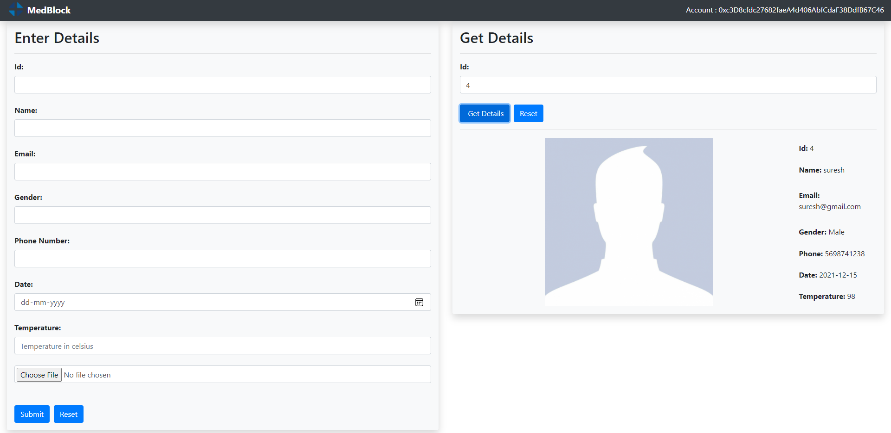

# **MedBlock**

### **About**

Medblock is a simple web application to book appointments for medical consultants and shows the booked appointment using the corresponding id. This application uses a combination of blockchain and InterPlanetary File System(IPFS) as a backend to store and access data.

### **Setting Up Environment**
- Install metamask (gateway for blockchain transcation)
- Install ganache ( personal Ethereum blockchain which you can use to run tests, execute commands, and inspect state while controlling how the chain operates.)
- Install Node js
- clone the git repo
  
  ```
  git clone https://github.com/uditmishr/medblock.git
  ````

- Install all required packages
    ```
    npm install
    ````

- compile Truffle file
    ```
    truffle compile
    ````

- Open ganche setup environment

- Migrate the truffle on network
    ```
    truffle migrate
    ````
### **GUI**


## **Note**
 
 **infura.io** has deprecated the public gateway on August 10th, 2022. Use dedicated gateway instead.
